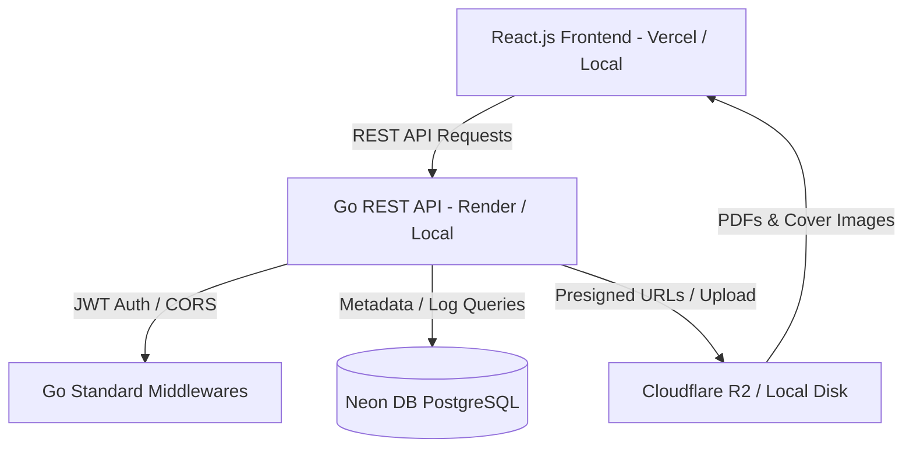

# Smiling Books Digital Library
An initiative of Akshar Paaul NGO

This repository contains the complete full-stack codebase for the **Smiling Books Digital Library**, a digital extension of Akshar Paaul NGO's physical library. The platform is designed to allow members of the public to browse, search, and read legally authorized children's books and educational materials online, while providing a secure management console for NGO administrators.

---

## Architecture Overview



- **Frontend**: React.js (Vite + TypeScript + Tailwind CSS v4 + React Router).
- **Backend**: Go (standard library `net/http` router, pgxpool).
- **Database**: PostgreSQL (Neon DB).
- **Object Storage**: Cloudflare R2 (S3-compatible API) with local filesystem fallback for development.
- **Authentication**: JWT-based stateless authentication for admin routes.

---

## Database Design

The database schema is designed for PostgreSQL and includes constraints to enforce copyright business rules.

### Database Tables & Indexes

```sql
-- Users (Administrators)
CREATE TABLE users (
    id UUID PRIMARY KEY DEFAULT uuid_generate_v4(),
    name VARCHAR(255) NOT NULL,
    email VARCHAR(255) UNIQUE NOT NULL,
    password_hash VARCHAR(255) NOT NULL,
    role VARCHAR(50) NOT NULL DEFAULT 'ADMIN',
    created_at TIMESTAMP WITH TIME ZONE DEFAULT CURRENT_TIMESTAMP NOT NULL
);

-- Authors / Categories / Languages
CREATE TABLE authors ( id SERIAL PRIMARY KEY, name VARCHAR(255) UNIQUE NOT NULL );
CREATE TABLE categories ( id SERIAL PRIMARY KEY, name VARCHAR(255) UNIQUE NOT NULL );
CREATE TABLE languages ( id SERIAL PRIMARY KEY, name VARCHAR(255) UNIQUE NOT NULL );

-- Books
CREATE TABLE books (
    id UUID PRIMARY KEY DEFAULT uuid_generate_v4(),
    title VARCHAR(255) NOT NULL,
    author_id INT NOT NULL REFERENCES authors(id) ON DELETE RESTRICT,
    description TEXT,
    language_id INT NOT NULL REFERENCES languages(id) ON DELETE RESTRICT,
    category_id INT NOT NULL REFERENCES categories(id) ON DELETE RESTRICT,
    age_group VARCHAR(50) NOT NULL,
    publication_year INT,
    cover_object_key VARCHAR(500),
    pdf_object_key VARCHAR(500),
    rights_status VARCHAR(50) NOT NULL DEFAULT 'PENDING_REVIEW',
    published BOOLEAN NOT NULL DEFAULT FALSE,
    created_at TIMESTAMP WITH TIME ZONE DEFAULT CURRENT_TIMESTAMP NOT NULL,
    updated_at TIMESTAMP WITH TIME ZONE DEFAULT CURRENT_TIMESTAMP NOT NULL,
    
    -- Business Rules: PENDING_REVIEW books CANNOT be published
    CONSTRAINT chk_rights_published CHECK (
        NOT (rights_status = 'PENDING_REVIEW' AND published = TRUE)
    ),
    CONSTRAINT chk_rights_status CHECK (
        rights_status IN ('PUBLIC_DOMAIN', 'LICENSED', 'PERMISSION_GRANTED', 'PENDING_REVIEW')
    )
);

-- Reading Events (Anonymous Analytics)
CREATE TABLE reading_events (
    id SERIAL PRIMARY KEY,
    book_id UUID NOT NULL REFERENCES books(id) ON DELETE CASCADE,
    created_at TIMESTAMP WITH TIME ZONE DEFAULT CURRENT_TIMESTAMP NOT NULL,
    ip_hash VARCHAR(64) NOT NULL
);
```

---

## API Documentation

All responses are served in a standard JSON envelope:
- **Success**: `{"success": true, "data": ...}`
- **Error**: `{"success": false, "error": {"code": "ERROR_CODE", "message": "Reason"}}`

### Public Endpoints
- `GET /api/books` - Search & filter catalog (supports: `q`, `category`, `language`, `age_group`, `sort`, `page`, `limit`)
- `GET /api/books/{id}` - Details of a specific book
- `GET /api/books/{id}/read` - Returns 1-hour signed URL to read PDF online, logging a reading event
- `GET /api/categories` - Fetch all category names
- `GET /api/languages` - Fetch all languages
- `GET /api/authors` - Fetch all authors list

### Admin Endpoints (Auth Protected via custom JWT Middleware)
- `POST /api/auth/login` - Logs in admin, returns token & sets cookie
- `POST /api/auth/logout` - Logs out admin, clears cookie
- `GET /api/admin/books` - Retrieve all books (includes unpublished)
- `POST /api/admin/books` - Create new book metadata
- `GET /api/admin/books/{id}` - Admin details view
- `PUT /api/admin/books/{id}` - Update book metadata (enforces check constraints)
- `DELETE /api/admin/books/{id}` - Permanently delete book metadata & R2 files
- `POST /api/admin/books/{id}/publish` - Publish a book (blocked if rights are pending)
- `POST /api/admin/books/{id}/unpublish` - Unpublish a book
- `POST /api/admin/books/{id}/upload-cover` - Upload cover image (validates JPG/PNG/WebP, max 2MB)
- `POST /api/admin/books/{id}/upload-pdf` - Upload book PDF text document (validates PDF, max 50MB)
- `GET /api/admin/analytics` - Total metrics, category distribution, popular books

---

## Local Development Instructions

Both frontend and backend are configured to run locally, connecting directly to your remote **Neon DB** instance.

### Prerequisites
- Go 1.22+ installed
- Node.js 18+ installed

### 1. Database Configuration
1. Obtain your connection string from your Neon DB console.
2. In the `backend` folder, copy `.env.example` to `.env` and set the `DATABASE_URL` variable.

### 2. Run Backend Server
The Go backend contains an integrated database migration and seeding utility:
```bash
cd backend

# Copy configuration
cp .env.example .env

# Run migrations and seed data (creates default admin & 10 public domain books)
go run cmd/server/main.go -migrate -seed

# Start the local development server (runs auto-migration checks automatically)
go run cmd/server/main.go
```
The server will start on port `8080` (e.g. `http://localhost:8080`).

### 3. Run Frontend Client
```bash
cd frontend

# Copy configuration
cp .env.example .env.local

# Install dependencies
npm install

# Run the client dev server
npm run dev
```
The frontend client will start on port `5173` (e.g. `http://localhost:5173`).

---

## Initial Admin Accounts & uploads

### First Admin Account
The database seeder automatically creates a default administrator:
- **Email**: `admin@smilingbooks.org`
- **Password**: `AdminSmilingBooks2026!`

### Adding Your First Book
1. Log in via `http://localhost:5173/admin/login`.
2. Navigate to **Manage Books** → **Add New Book**.
3. Fill in title, author, category, language, and select a **Rights Status**. Click **Create Book**.
4. In the Edit screen that opens, select a cover image file (< 2MB) and click **Upload Cover**.
5. Select a PDF document (< 50MB) and click **Upload PDF**.
6. Set the checkbox to **Publish** (disabled if rights are pending review) and click **Update Metadata** to make it live!

---

## Deployment Guidelines

### 1. Database (PostgreSQL)
We run migrations automatically during the Render startup script or via Neon DB directly. Connect database using Render or Vercel environment variables.

### 2. Frontend (Vercel)
- Root directory: `frontend`
- Build command: `npm run build`
- Output directory: `dist`
- Set Env Variable: `VITE_API_BASE_URL` to your Render API deployment URL.

### 3. Backend (Render)
- Environment: Go
- Build command: `cd backend && go build -o bin/server cmd/server/main.go`
- Start command: `cd backend && ./bin/server`
- Configure Environment variables: `DATABASE_URL`, `JWT_SECRET`, `FRONTEND_URL`, `USE_LOCAL_STORAGE=false`, and Cloudflare R2 credentials (`R2_ACCOUNT_ID`, etc.).

---

## Copyright & Compliance Framework

The Smiling Books platform is designed around strict legal constraints:
1. **Rule 1**: Only upload content that the NGO holds digitizing rights for.
2. **Rule 2**: Physical ownership of a paper book copy does NOT grant digital distribution rights.
3. **Rule 3**: Any book set to `PENDING_REVIEW` is blocked from publication server-side.
4. **Rule 4**: Standard library pre-signed URLs valid for 1 hour prevent file leeching or direct PDF sharing.
