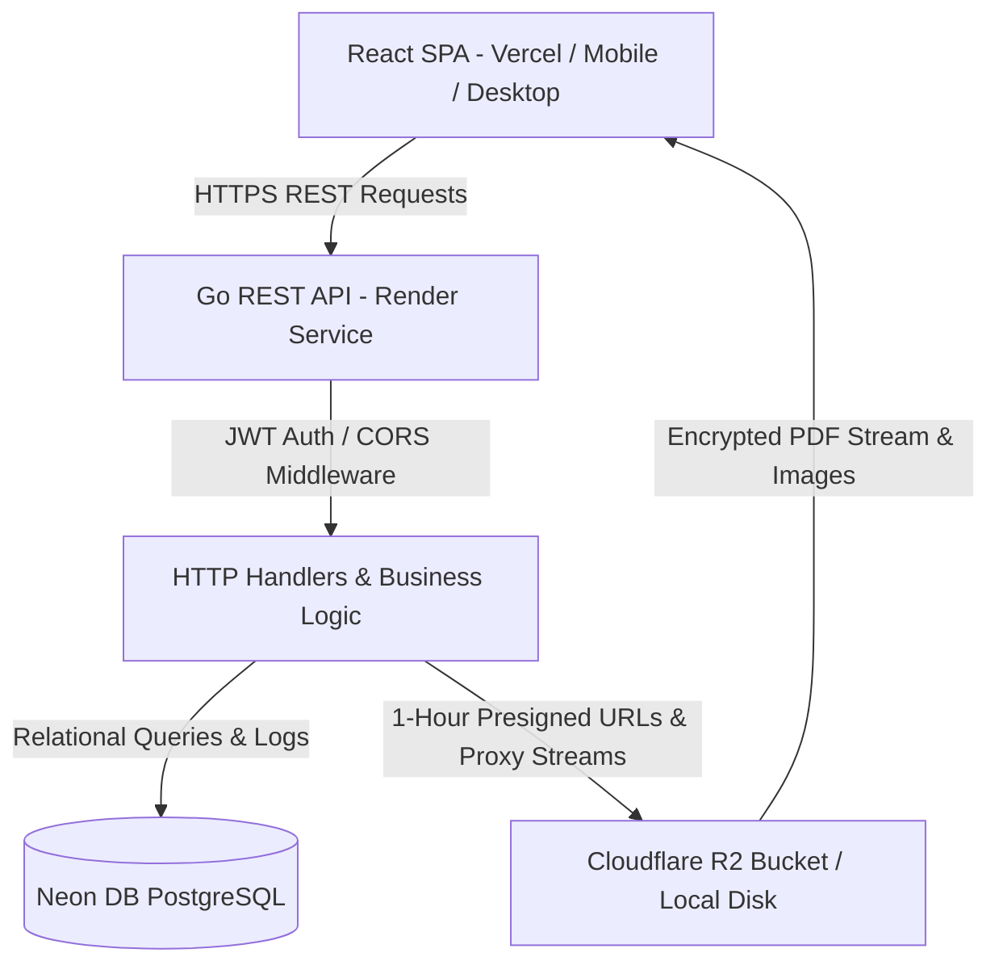
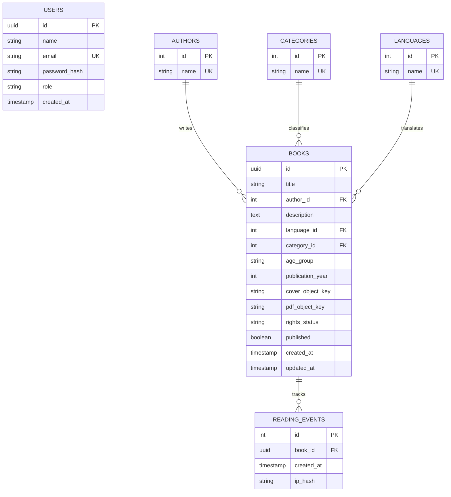

# System Architecture & Design Specification
## Smiling Books Digital Library | Akshar Paaul NGO

This document details the software architecture, data models, copyright compliance rules, security model, and multi-device rendering subsystem for the **Smiling Books Digital Library**.

---

## 1. High-Level Architecture Diagram



---

## 2. Component Specifications

### 2.1 Frontend Application Layer (`/frontend`)
- **Technology**: React 19, TypeScript, Vite 8, Tailwind CSS v4, Lucide React icons, React PDF.
- **Routing**: Client-side routing with `react-router-dom` v7.
- **State Management**: React Hooks + Local Storage for JWT tokens.
- **Responsive Subsystem**:
  - Auto-calculating `effectivePageWidth` container measurement for PDF rendering.
  - Swipe touch gesture handlers (`onTouchStart`, `onTouchEnd`) for mobile reading.
  - Breakpoint-aware admin management layout (Cards on mobile `< md`, Table on desktop `≥ md`).

### 2.2 Backend Service Layer (`/backend`)
- **Technology**: Go (Golang 1.22+), standard `net/http` server, `golang.org/x/crypto/bcrypt`.
- **Database Driver**: `jackc/pgx/v5` with connection pooling (`pgxpool`).
- **AWS / S3 SDK**: `aws-sdk-go-v2` tailored for Cloudflare R2 bucket integration.
- **CORS Middleware**: Dynamic origin matching for `localhost`, `127.0.0.1`, Vercel previews (`*.vercel.app`), Render domains (`*.onrender.com`), and private LAN IP ranges (`192.168.x.x`, `10.x.x.x`, `172.x.x.x`).

### 2.3 Database Layer (Neon DB PostgreSQL)
- **Database**: PostgreSQL serverless instance hosted on Neon DB.
- **Migrations & Seeding**: Automated Go migration engine executed at server startup.

### 2.4 Storage Layer (Cloudflare R2)
- **Primary**: Cloudflare R2 S3-compatible API.
- **Development Fallback**: Local filesystem storage (`LOCAL_STORAGE_DIR=./storage`).

---

## 3. Database Entity Relationship Diagram (ERD)



---

## 4. Copyright & Compliance Business Rules Engine

The system strictly enforces compliance rules at both database constraint level and backend application handler level:

1. **Rights Statuses**:
   - `PUBLIC_DOMAIN`: Book copyright has expired or is freely licensable.
   - `LICENSED`: Explicit written agreement signed with author/publisher.
   - `PERMISSION_GRANTED`: Written grant from rights holder for Akshar Paaul NGO.
   - `PENDING_REVIEW`: Rights status under legal review.

2. **Database Level Constraint**:
   ```sql
   CONSTRAINT chk_rights_published CHECK (
       NOT (rights_status = 'PENDING_REVIEW' AND published = TRUE)
   )
   ```
   *Result*: The PostgreSQL database engine will physically reject any `INSERT` or `UPDATE` operation attempting to set `published = TRUE` when `rights_status = 'PENDING_REVIEW'`.

3. **Backend Enforcement**:
   - The `/api/admin/books/{id}/publish` endpoint checks rights status prior to setting publication status.
   - Public endpoint `/api/books` filters records to return ONLY `published = TRUE` records.

---

## 5. Security & Authentication Architecture

1. **Stateless JWT Tokens**:
   - Administrators authenticate via `POST /api/auth/login`.
   - The server issues a signed JWT containing user claims (`sub`, `name`, `email`, `role`, `exp`).
   - Admin handlers check claims via `AuthMiddleware`.

2. **PDF Streaming & Anti-Leech Protection**:
   - Direct Cloudflare R2 bucket URLs are kept private.
   - Readers access book content via stream proxy `/api/books/{id}/pdf` or 1-hour presigned URLs.
   - Prevents public indexation or direct raw URL sharing.
